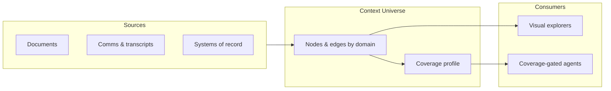

# Context Universe

A prototype for the **Intelligence Layer**: a machine-readable, queryable graph of an organisation’s institutional knowledge. Each **universe** is a JSON graph of nodes (concepts, rules, judgments, skills) and edges (relationships). The repo includes interactive explorers to navigate those graphs and documentation for the underlying model.

> **Context Universe** sits between the organisation and every AI tool. It holds the real intelligence, feeds it into agents, and (in a full implementation) learns from execution. See [docs/context-universe-spec.md](docs/context-universe-spec.md) for the formal definition, schema, and coverage-gated agent design.

## What's in the repo

| Path | Description |
|------|-------------|
| [`index.html`](index.html) | **3D Universe Explorer** — Three.js graph with universe switcher, search, and node detail panel |
| [`intelligence_map/viridian-intelligence-map.html`](intelligence_map/viridian-intelligence-map.html) | **Viridian intelligence map** — D3 layered view (sources → knowledge → micro-skills) |
| [`universes/`](universes/) | Universe definitions as JSON |
| [`docs/`](docs/) | Spec, outcomes framework, decks, whitepaper, screenshots |
| [`archive/`](archive/) | Earlier explorer versions |

## Quick start

Universe JSON is loaded via `fetch`, so you need a local HTTP server (opening `index.html` directly as `file://` will only show the embedded fallback universe).

```bash
# From the repo root
python3 -m http.server 8080
```

Then open:

- **Explorer:** [http://localhost:8080/](http://localhost:8080/)
- **Viridian map:** [http://localhost:8080/intelligence_map/viridian-intelligence-map.html](http://localhost:8080/intelligence_map/viridian-intelligence-map.html)

### Explorer controls

- **Drag** — rotate the graph
- **Click a node** — open detail panel (description, connections, optional work-unit sections and signals)
- **`/`** — focus search
- **`Esc`** — clear selection and search

## Sample universes

| File | Name |
|------|------|
| [`universes/viridian-intelligence-layer.json`](universes/viridian-intelligence-layer.json) | Viridian — Financial Intelligence Layer |
| [`universes/wealth-advisory-context.json`](universes/wealth-advisory-context.json) | Wealth Advisory — Institutional Context |
| [`universes/portfolio-analysis.json`](universes/portfolio-analysis.json) | Portfolio Analysis — Org Intelligence |
| [`universes/ai-company.json`](universes/ai-company.json) | AI Company — Product & Market |

Switch between them in the explorer’s universe dropdown.

## Universe JSON format

Each file under `universes/` follows a common shape:

```json
{
  "id": "my-universe",
  "name": "Display Name",
  "desc": "Short description for the switcher.",
  "icon": "🧠",
  "iconBg": "linear-gradient(135deg, #0d9488, #065f46)",
  "domainColors": {
    "Strategy": "0x0d9488",
    "Regulatory": "0xef4444"
  },
  "nodes": [
    {
      "id": "node-1",
      "label": "Human-readable label",
      "domain": "Strategy",
      "type": "Strategic Pillar",
      "desc": "What this node represents.",
      "weight": 5
    }
  ],
  "edges": [
    { "source": "node-1", "target": "node-2", "label": "informs" }
  ]
}
```

**Optional node fields** (used by some universes and the detail panel):

- `work_unit` — structured sections (e.g. sensing signals, judgment, language) for work-unit nodes
- `signals` — array of `{ "level", "source" }` for provenance / signal lineage

**Domain colours** are hex strings without `#` (e.g. `"0x3b82f6"`), mapped per domain for layout and styling.

### Adding a universe

1. Add `universes/your-universe.json` using the format above.
2. Register it in `index.html` by appending the path to `UNIVERSE_FILES`:

```javascript
const UNIVERSE_FILES = [
  'universes/ai-company.json',
  // ...
  'universes/your-universe.json',
];
```

3. Reload the explorer (with the local server running).

## Documentation

| Document | Purpose |
|----------|---------|
| [context-universe-spec.md](docs/context-universe-spec.md) | Definition, minimal schema, coverage profile, agent spin-out |
| [outcomes-framework.md](docs/outcomes-framework.md) | Outcome areas for measuring intelligence-layer value |
| [Introduction-intelligence-mapping-v2.html](docs/Introduction-intelligence-mapping-v2.html) | Product narrative deck |
| [whitepaper-v4.html](docs/whitepaper-v4.html) | Whitepaper |
| [genai-capability-paths.html](docs/genai-capability-paths.html) | GenAI capability paths |
| [screenshots/](docs/screenshots/) | UI reference captures (curation, lineage, resolution workspace, etc.) |

## Architecture (conceptual)



In a production system, a **router** would classify user intent, check **coverage** (which domains are populated enough), retrieve relevant subgraph context, and invoke only agents that have sufficient institutional knowledge — not empty copilots.

## Tech stack

- **Explorer:** vanilla HTML/JS, [Three.js](https://threejs.org/) (CDN), no build step
- **Viridian map:** [D3](https://d3js.org/) v7 (CDN)
- **Data:** static JSON; no backend in this repo

## License

No license file is included yet. Add one if you plan to open-source or share the repo.
