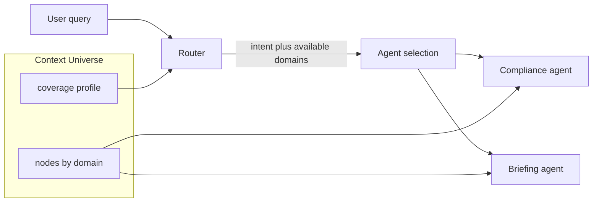

# Context Universe — specification

Definition, minimal schema, and agent spin-out design for the Intelligence Layer. For deck narrative and future implementation (router, MCP, agents).

---

## 1. Definition

**Context Universe**: The machine-readable, queryable graph of an organisation's institutional knowledge. It is the implemented form of the Intelligence Layer.

- **Role**: Sits between the organisation and every AI tool (Claude, Copilot, point solutions). Holds the real intelligence; feeds it into any tool; learns from every execution.
- **Contents**: Nodes (concepts, rules, judgments, decisions, patterns) and edges (relationships, dependencies). Nodes are tagged by **domain** and **type**; optional attributes include confidence, provenance, last-updated.
- **Availability**: At any time the Universe has a **coverage profile** — which domains and work units have been populated, how dense they are, and what is missing (gaps flagged for curation). This profile drives which agents are exposed or can run.

---

## 2. Minimal schema

### Nodes

| Field | Description |
| ----- | ----------- |
| `id` | Unique identifier. |
| `label` | Human-readable label. |
| `domain` | Category of knowledge (e.g. Strategy, Regulatory, Adviser Practice, Client, Institutional Memory, Language, Work Unit, Relationships, Exceptions). |
| `type` | Kind of node (e.g. rule, judgment, exception, pattern, decision). |
| `desc` | Short description or content. |
| `weight` | Optional importance or confidence (e.g. 1–5 or 0–1). |
| `provenance` | Optional source or last-updated. |

### Edges

| Field | Description |
| ----- | ----------- |
| `source` | Node id. |
| `target` | Node id. |
| `label` | Relationship type (e.g. embodies, constrains, informs). |

### Coverage profile

Derived from the graph (not stored as a separate entity). For each domain and optionally each work unit:

- **Populated**: Whether the domain has a minimum number/density of nodes.
- **Density**: Count or weight of nodes (and optionally edges) in that domain.
- **Gaps**: Missing or under-specified areas flagged for curation.

The coverage profile is what the router or UI uses to decide which agents to expose (see Agent spin-out below).

---

## 3. Agent spin-out

Agents (micro-skills, copilots, workflows) are only offered or invoked when the Context Universe has **sufficient context** for that agent's domain and task.

### 3.1 Coverage-gated agents

Each agent declares which **domains** (and optionally work units) it needs, and a **minimum density** or threshold.

- The system only exposes or enables that agent when the Universe's coverage profile includes those domains with at least the required density.
- Example: Compliance Q&A agent requires `Regulatory` (and optionally `Firm`) with minimum node count or weight; it appears only when that condition is met.

### 3.2 Intent routing

User asks in natural language. The router:

1. Classifies **intent** (e.g. compliance question, client briefing, SOA draft).
2. Maps intent to the **agent(s)** that can fulfil it and the **domains** they need.
3. Checks the coverage profile: are those domains populated?
4. If yes: retrieves relevant context (nodes/edges) from the Universe and invokes the matching agent with that context.
5. If no: responds that the capability is not yet available or suggests what context would need to be added.

### 3.3 Dynamic capability list

The Universe (or a service on top of it) exposes **available capabilities** based on current coverage.

- Example: `Client briefing: available` (Client + Practice dense); `Regulatory Q&A: available` (Regulatory dense); `Onboarding playbook: insufficient context` (relevant domains sparse).
- UI or API only shows or calls agents that are listed as available. No “empty” agents.

### 3.4 Data flow

### 3.5 Agent–domain contract (example)

| Agent | Required domains | Optional |
| ----- | ---------------- | -------- |
| Compliance Q&A | Regulatory | Firm |
| Client briefing | Client, Adviser Practice | Institutional Memory |
| SOA drafting | Regulatory, Language, Firm | Work Unit |
| Meeting summary | Adviser Practice, Language | — |
| Regulatory lookup | Regulatory | — |

Implementation can enforce this contract by checking the coverage profile before registering or suggesting the agent.

---

## 4. Summary

- **Context Universe** = graph of institutional knowledge (nodes, edges, domains, types) with a derived **coverage profile**.
- **Agent spin-out** = agents are gated by what context exists; coverage profile + intent routing (and optionally a dynamic capability list) determine which agents run and what context they receive.
- See the deck ([Introduction-intelligence-mapping-v2.html](../Inbox/Introduction-intelligence-mapping-v2.html)) for the product narrative and “How to use it”; this spec is the single definition for build and partner handoff.
